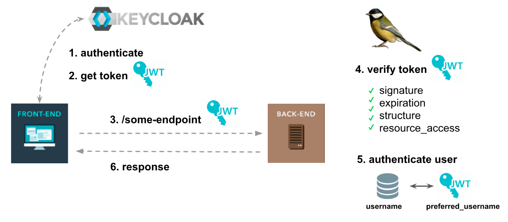

- Documentation: [https://www.keycloak.org/documentation](https://www.keycloak.org/documentation)
- API Admin: [https://www.keycloak.org/docs-api/15.0/rest-api/index.html#\_users_resource](https://www.keycloak.org/docs-api/15.0/rest-api/index.html#_users_resource)
- Examples Docker Composes: [https://github.com/keycloak/keycloak-containers/blob/master/docker-compose-examples/keycloak-postgres.yml](https://github.com/keycloak/keycloak-containers/blob/master/docker-compose-examples/keycloak-postgres.yml)
- Example With NodeJS: [https://medium.com/devops-dudes/securing-node-js-express-rest-apis-with-keycloak-a4946083be51](https://medium.com/devops-dudes/securing-node-js-express-rest-apis-with-keycloak-a4946083be51)
- Front Example: [https://github.com/victorMagalhaesPacheco/keycloak-react](https://github.com/victorMagalhaesPacheco/keycloak-react)

